### 声明：切勿使用本软件从事任何违法事宜，使用本软件产生的任何后果皆由使用者承担，本软件及开发者概不承担任何责任。
### 【2025】开源版本全新升级2.0.0版本，如果使用原先的版本请查看old分支。

### 企业版更新【2025年7月】
1. PC版本支持暗黑模式和自定义主题色

### 企业版更新【2025年6月】
1. PC版本云盘功能

### 企业版更新【2025年5月】
1. 全新的零入侵插件方案
2. 视频会议系统
3. Oauth2单点登录系统
4. 内部邮件系统
5. 文件管理系统
6. 集群部署方案
7. 上传附件签名去重，实现重复文件秒传，pc版本实现文件本地打开模式

### 企业版更新【2024年12月】
1. 新增接龙功能
2. 修改插件接入方式，无入侵方案
3. 优化部分代码，修复2个bug。

### 企业版更新【2024年10月】

1. PC端支持docx,xlsx,pdf，txt在线打开
2. 手机app端支持使用系统自动软件打开office，pdf附件
3. 支持图片右键复制为blob类型
4. 附件图标支持office类型图标
5. 支持ARM平台linux打包deb类型安装包

#### V-IM 文档：https://juejin.cn/column/7515468131328180260
#### V-IM-PRO 文档：https://juejin.cn/column/7508566000351494155

### 企业版测试

>   1. 企业版下载(windows)：https://v-im-oss.oss-cn-beijing.aliyuncs.com/v-im-pro/pc/v-im-pro-4.1.7-setup.exe
>   2. 企业版下载(linux AMD64，不同的linux可能是需要不同的包，必须在本平台下打包才能安装，比如AMD的CPU打包的在ARM架构的liunx下不能安装)：https://v-im-oss.oss-cn-beijing.aliyuncs.com/v-im-pro/pc/v-im-pro_4.0.7_amd64.deb
>   3. 企业版安卓APP https://v-im-oss.oss-cn-beijing.aliyuncs.com/v-im-pro/mobile/__UNI__87756B6_0922182318.apk
>   4. 网页版 https://42.202.135.80/#/
>   5. 服务端地址 42.202.135.80
>   6. MAC安装包(arm64) https://v-im-oss.oss-cn-beijing.aliyuncs.com/v-im-pro/pc/v-im-pro-4.1.7.dmg

### 企业版优势。
> 1. 多终端支持：PC(windows、linux、web) electron方案。
> 2. 手机（安卓、IOS、H5、小程序）,uni-app方案。
> 3. 上传支持三种方案(直接存服务器、minio、阿里云OSS)。
> 4. 私有云代码仓库（一年内免费更新），无加密部分，不依赖第三方。
> 5. 一对一技术支持。
> 6. bug修复优先级最高。
> 7. 支持付费定制化需求。
> 8. 功能更新频率高。
> 9. 集成成本最低的解决方案，前端技术路径就是Vue3技术栈，后端是Springboot3技术栈。

#### 企业版咨询加微，源码微信联系（有偿）:备注v-im!

### 企业版截图
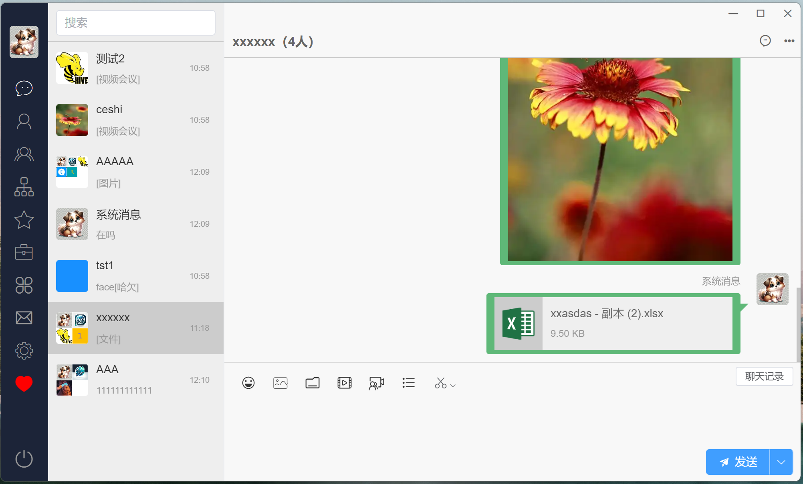
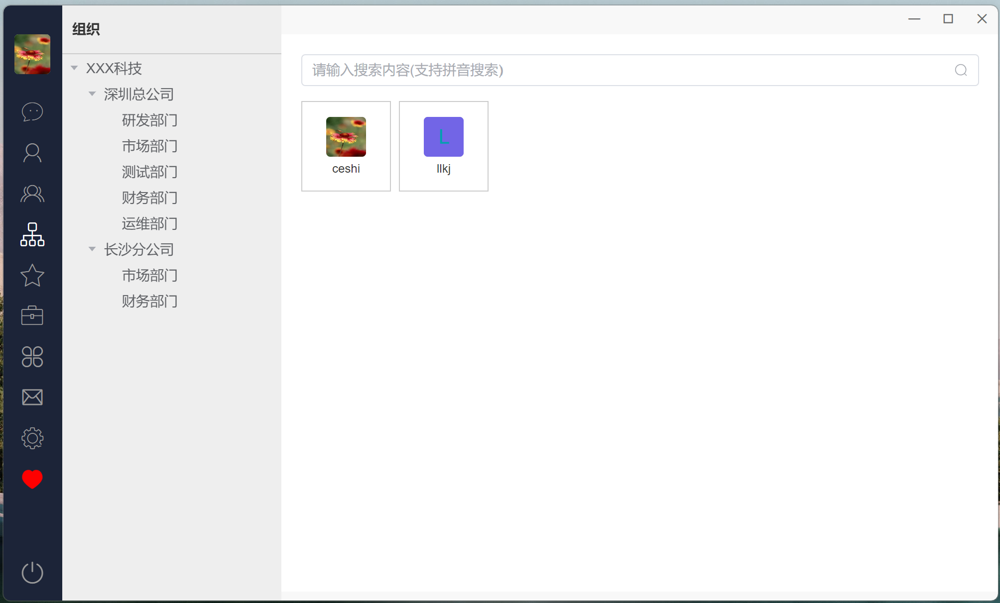
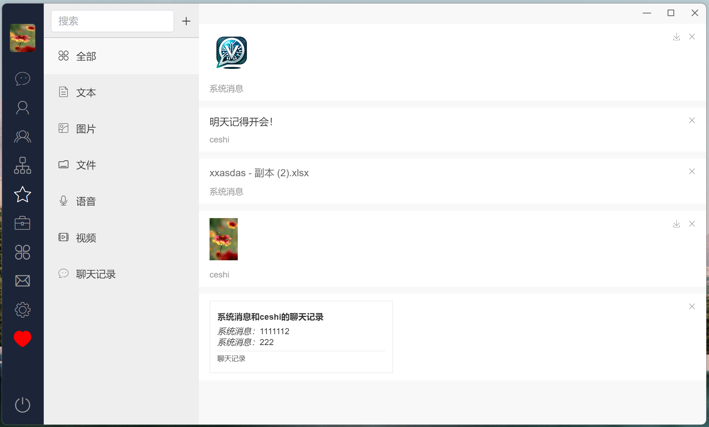
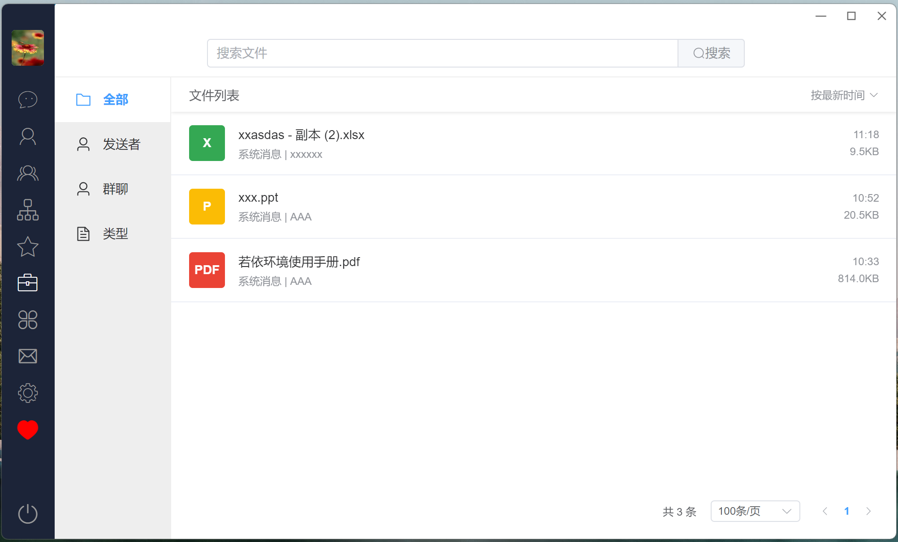
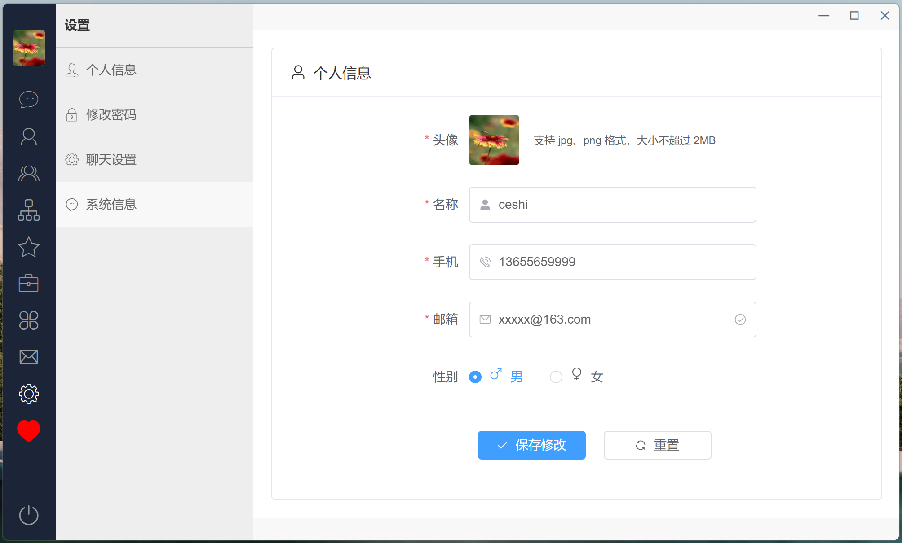

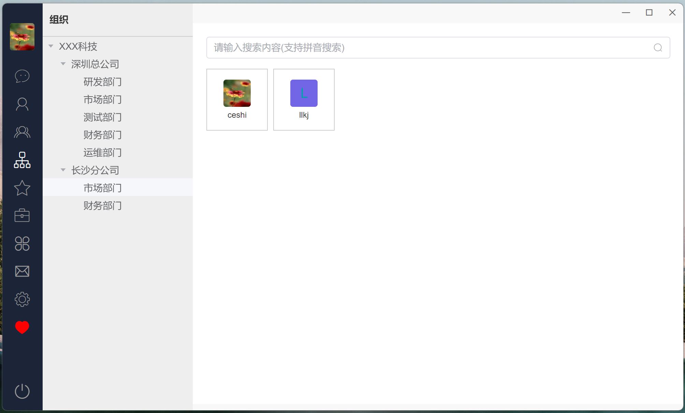
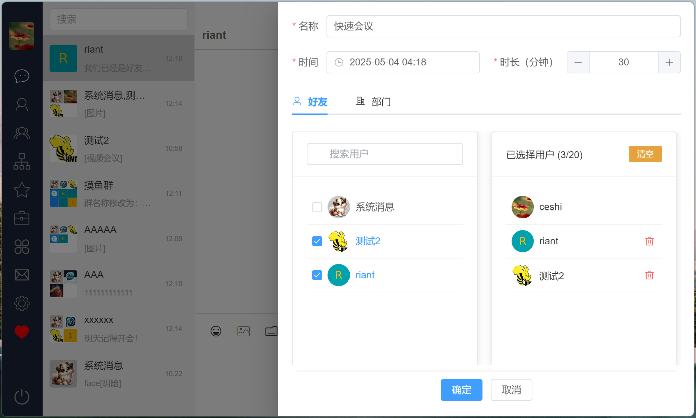

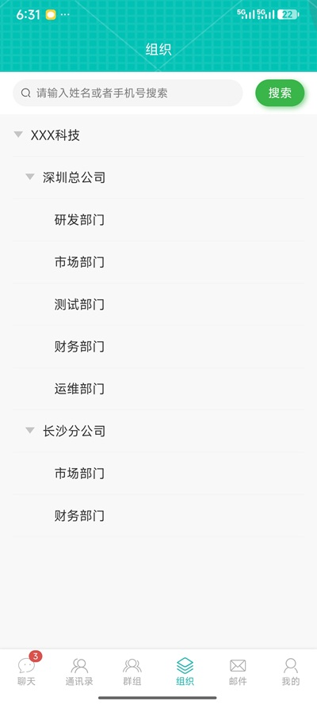
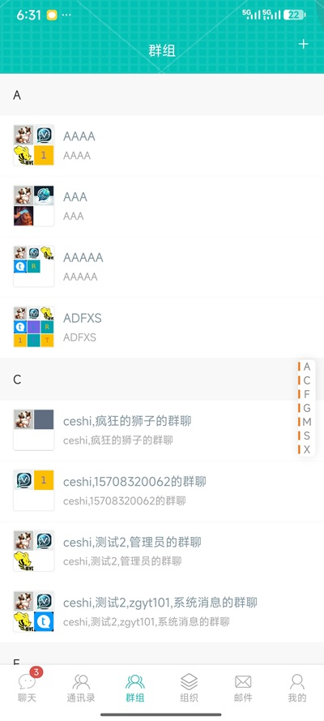
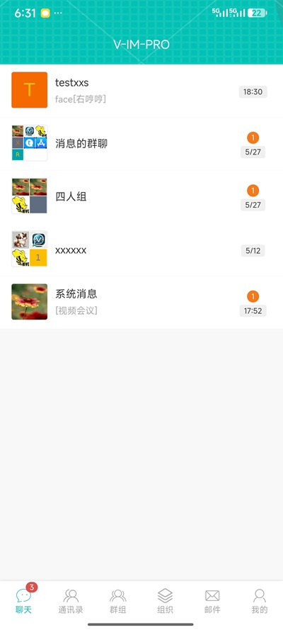
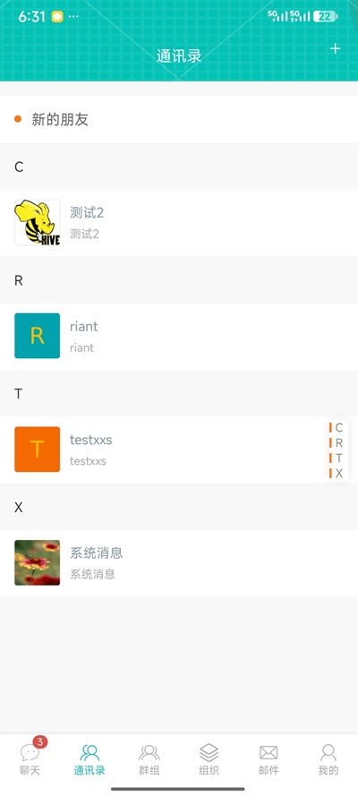
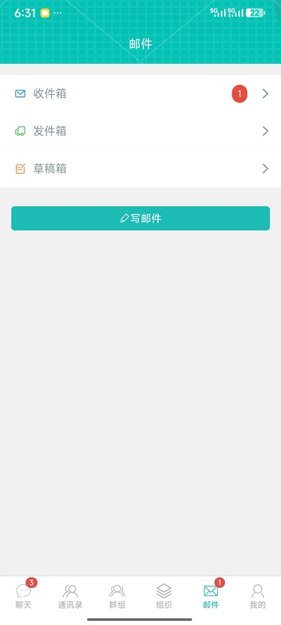
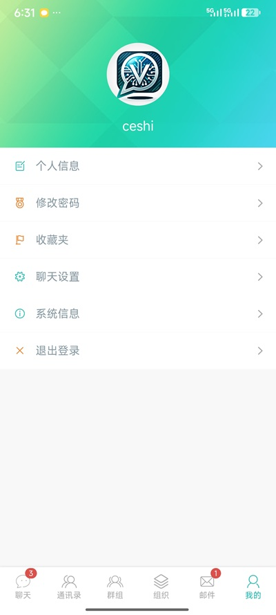
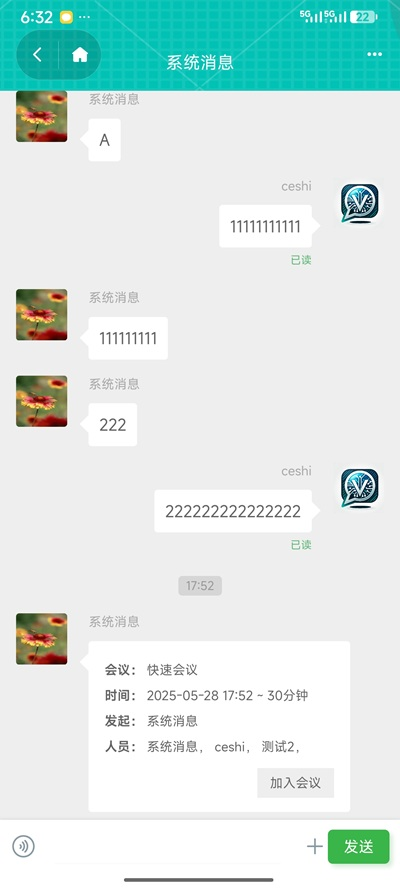
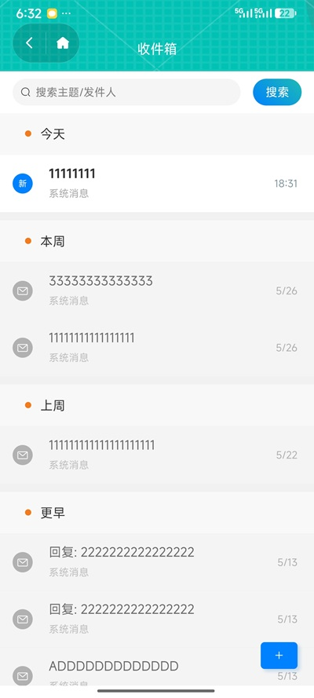

## 1. 产品概述

V-IM 是一款基于 Electron 和 Vue 3 开发的跨平台即时通讯客户端，目前正在进行2025年版本的开发。该应用提供了丰富的即时通讯功能，支持个人聊天、群组聊天、文件传输等功能，适用于企业内部通讯或团队协作场景。

## 2. 核心功能

### 2.1 用户账户管理
- **登录功能**：支持账户密码登录
- **注册功能**：新用户注册
- **多端设备登录**：支持手机和电脑同时在线，同类型设备互斥。
- **个人资料管理**：修改头像、个人信息等

### 2.2 即时通讯功能
- **单聊（私聊）**：支持一对一聊天
- **群聊**：支持多人群组聊天
- **消息类型**：
  - 文本消息
  - 图片消息
  - 文件消息
  - 语音消息
  - 视频消息
  - 事件消息
- **消息状态**：
  - 消息已读回执
- **实时通讯**：基于WebSocket的实时消息推送
- **消息历史记录**：查看历史聊天记录

### 2.3 联系人管理
- **好友管理**：
  - 添加好友
  - 好友分组
  - 好友搜索
  - 好友请求验证
- **部门管理**：组织架构查看
- **群组管理**：
  - 创建群组
  - 群组邀请
  - 群组成员管理
  - 修改群名称

### 2.4 文件传输
- **文件上传**：支持各类文件的上传和发送
- **图片处理**：图片压缩和转换

### 2.5 系统功能
- **系统通知**：新消息提醒、好友请求、群邀请等通知
- **多平台支持**：Windows、MacOS、Linux
- **自动更新**：客户端自动检查和安装更新

## 3. 技术架构

### 3.1 客户端架构
- **框架**：Electron + Vue 3 + TypeScript
- **状态管理**：Pinia（支持持久化存储）
- **UI组件**：Element Plus
- **构建工具**：Electron Vite
- **进程模型**：主进程（Main）+ 渲染进程（Renderer）+ 预加载脚本（Preload）

### 3.2 通信协议
- **HTTP/HTTPS**：基于RESTful API进行数据交互
- **WebSocket**：实现实时消息推送
- **心跳机制**：保持连接活跃，自动重连

### 3.3 安全机制
- **加密传输**：支持SSL加密传输
- **身份验证**：sa-token认证

## 4. 特色功能

- **表情包支持**：内置表情包功能
- **@功能**：群聊中支持@特定用户
- **拼音搜索**：支持拼音搜索联系人
- **剪贴板集成**：支持粘贴、拖拽上传等功能

### 交流授权
>  1. 如果您觉得好用，可以给点个star，或者给个捐赠。
>  2. 本项目仅供学习，商用请购买企业版。
>  3. 非授权商用，会有被诉讼风险。