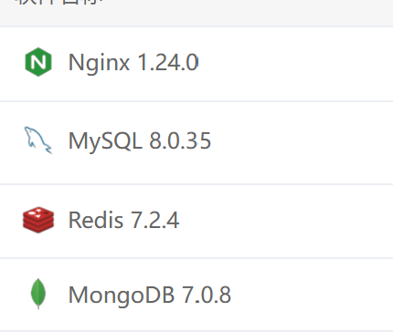

### 项目模块介绍
1. v-im-server模块是v-im的核心服务模块，包含用户管理、会话管理、消息管理、群组管理、好友管理
2. v-im-server-ry-plus模块是v-im与ruoyi-vue-plus的集成模块，继承 VimBridgeService 接口，实现定义的接口方法，即可实现v-im通过ruoyi-vue-plus的用户体系登录等功能。
3. 如果你不想使用ruoyi-vue-plus的用户体系，只需要自己实现VimBridgeService的接口方法即可。
### 数据库 redis7、mongodb7、mysql8

### 启动项目
v-im-server-2025/v-im-server-ry-plus/src/main/java/com/vim/VimApplication.java
### 导入数据
doc 下 v-im.sql 导入到 master数据库，slave库就是ruoyi-vue-plus的sql,请自行去该项目找对应的导入sql到slave库，如果你仅仅想启动下项目，请直接导入sys.sql到 slave库(不要管理后台)
### 配置数据库连接
v-im-server-2025\v-im-server\src\main\resources\application.yml

        # 主库数据源
        master:
          type: ${spring.datasource.type}
          driverClassName: com.mysql.cj.jdbc.Driver
          # jdbc 所有参数配置参考 https://lionli.blog.csdn.net/article/details/122018562
          # rewriteBatchedStatements=true 批处理优化 大幅提升批量插入更新删除性能(对数据库有性能损耗 使用批量操作应考虑性能问题)
          url: jdbc:mysql://127.0.0.1:3306/v-im-2025?useUnicode=true&characterEncoding=utf8&zeroDateTimeBehavior=convertToNull&useSSL=true&serverTimezone=GMT%2B8&autoReconnect=true&rewriteBatchedStatements=true&allowPublicKeyRetrieval=true&nullCatalogMeansCurrent=true
          username: v-im-2025
          password: v-im-2025
        # 从库数据源，如果这里你使用的是自己的用户体系，就改成自己的数据源
        slave:
          lazy: false
          type: ${spring.datasource.type}
          driverClassName: com.mysql.cj.jdbc.Driver
          url: jdbc:mysql://127.0.0.1:3306/ruoyi-vue-plus?useUnicode=true&characterEncoding=utf8&zeroDateTimeBehavior=convertToNull&useSSL=true&serverTimezone=GMT%2B8&autoReconnect=true&rewriteBatchedStatements=true&allowPublicKeyRetrieval=true&nullCatalogMeansCurrent=true
          username: ruoyi-vue-plus
          password: ruoyi-vue-plus

主数据源（master）就是v-im所用到的数据源，从库数据源（slave）是指的ruoyi-vue-plus的数据源
### 配置redis mongodb 连接,这里不需要导入数据
      data:
        mongodb:
          uri: mongodb://v-im.cn:27017/v-im
    
        redis:
          # 地址
          host: 127.0.0.1
          # 端口，默认为6379
          port: 6379
          # 数据库索引
          database: 5
          # 连接超时时间
          timeout: 10s
          lettuce:
            pool:
              # 连接池中的最小空闲连接
              min-idle: 0
              # 连接池中的最大空闲连接
              max-idle: 32
              # 连接池的最大数据库连接数
              max-active: 32
              # #连接池最大阻塞等待时间（使用负值表示没有限制）
              max-wait: -1ms

docker 部署请参考 docker 文件夹下的readme